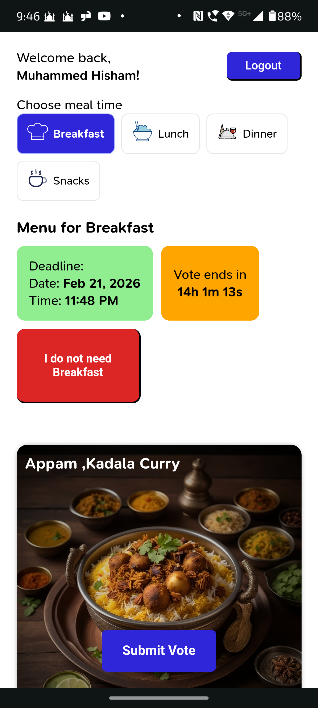
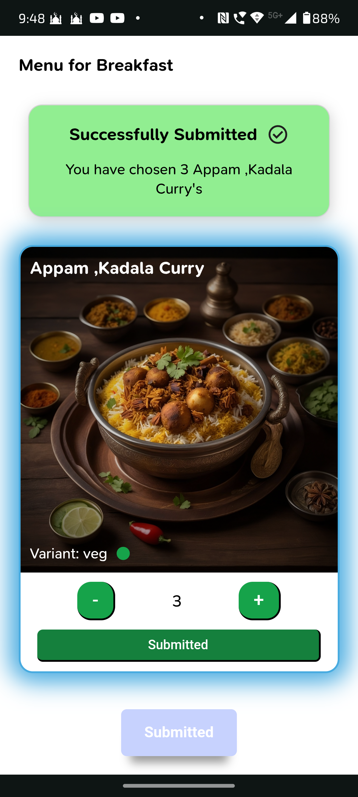
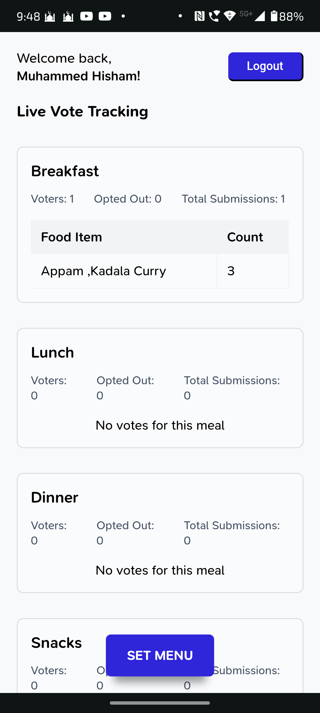
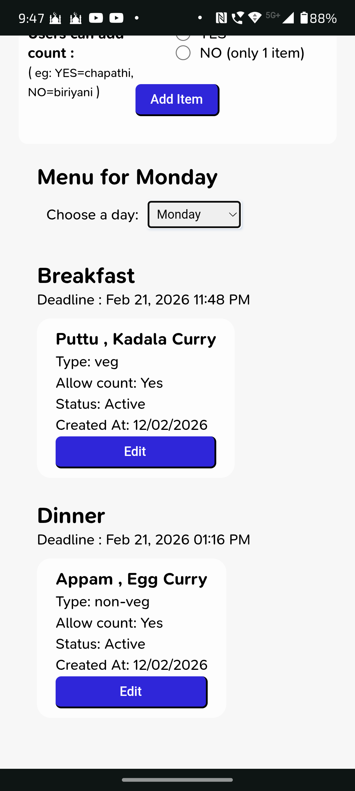

# 🍽️ Meal Cast

## 🚀 Live Application

Production Deployment:  
https://meal-cast.vercel.app/

---

Meal Cast is a real-time meal voting and management system built for organizations.  
It enables employees to select meals (Breakfast, Lunch, Dinner, Snacks) before configurable cutoff times, while administrators manage weekly menus and monitor live voting counts.

The system enforces strict deadline logic and ensures accurate meal planning through automatic submission mechanisms and real-time updates powered by Firebase.

---

## 📸 Screenshots

<p align="center">
  
  
  
  
  
</p>

## 🚀 Core Features

### 👤 Employee Module

- View available meals by:
  - Breakfast
  - Lunch
  - Dinner
  - Snacks
- Select and submit meal preferences
- Update selection before cutoff time
- Automatic submission when deadline expires
- Real-time countdown timer for each meal
- Locked state after submission
- Snackbar notifications for feedback
- Protection against unintended cross-meal submission

---

### 🛠️ Admin Module

- Configure weekly menus
- Add / edit / disable menu items
- Set cutoff times per meal
- Preview weekly meal configurations
- Real-time voting count dashboard
- Clear deadline behavior handling:
  eg:
  - **Breakfast cutoff → Applies to next day**
  - **Lunch & Dinner cutoff → Applies to same day**

---

## 🔴 Real-Time Voting Count (Admin Dashboard)

The admin dashboard displays **live voting counts per meal time** using:

- Firebase Realtime Database
- Real-time listener callbacks (onValue)
- WebSocket-based real-time synchronization provided by Firebase

Whenever an employee submits or updates a vote:

- The database updates instantly
- Admin dashboard reflects updated counts immediately
- No page refresh required
- Fully event-driven architecture

This ensures:

- Accurate meal planning
- Live monitoring
- Immediate operational visibility

---

## 🧠 System Logic & Architecture

### ⏳ Deadline & Auto-Submission Logic

Auto-submit triggers only when:

- Meals are loaded
- Deadlines are loaded
- Countdown is expired
- Meal is not already submitted

This prevents:

- Duplicate submissions
- Cross-meal interference
- Premature execution due to state changes

Switching meal tabs does NOT trigger unintended submissions.

---

## 🏗️ Tech Stack

### Frontend

- React
- React Router
- Context API (State Management)
- CSS (Modular Styling)

### Backend / Realtime

- Firebase Realtime Database
- Firebase Authentication (working on it)
- Firebase WebSocket-based real-time listeners

### Time & Logic Handling

- Native JavaScript Date APIs
- Countdown state synchronization
- Controlled `useEffect` lifecycle management

---

## 📂 Project Structure

```
src/
│
├── App.jsx
├── main.jsx
│
├── assets/
│ ├── fonts/
│ │ └── snpro/
│ │ ├── SNPro-Italic-VariableFont_wght.ttf
│ │ └── SNPro-VariableFont_wght.ttf
│ │
│ └── svg/
│ ├── breakfast_icon.svg
│ ├── check_circle.svg
│ ├── circle_notifications.svg
│ ├── dinner_icon.svg
│ ├── error_circle.svg
│ ├── lunch_icon.svg
│ ├── report.svg
│ ├── send.svg
│ ├── simple_check.svg
│ ├── snacks_icon.svg
│ ├── warning.svg
│
├── colors/
│
├── components/
│ ├── admin_components/
│ │ └── setmenu_components/
│ │ ├── MealListPreview.css
│ │ ├── MealListPreview.jsx
│ │ └── SetMenuForm.jsx
│ │
│ ├── DialogBox/
│ │ ├── DialogBox.css
│ │ └── DialogBox.jsx
│ │
│ ├── employee_components/
│ │ ├── DashboardHeader/
│ │ │ ├── DashboardHeader.css
│ │ │ └── DashboardHeader.jsx
│ │ │
│ │ ├── FoodCard/
│ │ │ ├── FoodCard.css
│ │ │ └── FoodCard.jsx
│ │ │
│ │ ├── MealHeader/
│ │ │ ├── MealHeader.css
│ │ │ └── MealHeader.jsx
│ │ │
│ │ ├── MealTimeSelector/
│ │ │ ├── MealTimeSelector.css
│ │ │ └── MealTimeSelector.jsx
│ │ │
│ │ ├── SubmissionSummary/
│ │ │ ├── SubmissionSummary.css
│ │ │ └── SubmissionSummary.jsx
│ │ │
│ │ └── SubmitButton/
│ │ ├── SubmitButton.css
│ │ └── SubmitButton.jsx
│ │
│ └── SnackBar/
│ ├── SnackBar.css
│ └── SnackBar.jsx
│
├── constants/
│ ├── colors.js
│ ├── day.constants.js
│ ├── firebase_constants.js
│ ├── meals.js
│ ├── mealTime.constants.js
│ └── storageKeys.js
│
├── context/
│ ├── AuthContext.jsx
│ └── SnackBarContext.jsx
│
├── hooks/
│ └── useCountdownHook.js
│
├── pages/
│ ├── admin_dashboard/
│ │ ├── AdminDashboard.css
│ │ ├── AdminDashboard.jsx
│ │ └── SetMenuItems/
│ │ ├── SetMenu.css
│ │ └── SetMenu.jsx
│ │
│ ├── employee_dashboard/
│ │ ├── EmployeeDashboard.css
│ │ └── EmployeeDashboard.jsx
│ │
│ ├── login/
│ │ ├── Login.css
│ │ └── Login.jsx
│ │
│ └── page_not_found/
│ └── PageNotFound.jsx
│
├── reducer/
│
├── routes/
│ └── routes.js
│
├── services/
│ ├── firebase.js
│ └── meals/
│ ├── mealDeadlines.service.js
│ ├── mealOptions.service.js
│ └── mealSubmission.service.js
│
├── styles/
│ ├── buttons.css
│ ├── fonts.css
│ ├── forms.css
│ ├── globals.css
│ └── variables.css
│
├── unpushed_files/
│ ├── loaders.js
│ ├── mealOptionsState_model.js
│ ├── payload_model.txt
│ └── state of the mealOptions.png
│
└── utils/
├── calculateDeadlineISO.utils.js
├── captitalize.first.utils.js
├── deadlineFormat.utils.js
├── getTodayWeekday.utils.js
├── strucrureMeals.utils.js
├── structureSubmissions.utils.js
├── timeLeft.utils.js
└── utcConversion.utils.js
```

---

## 🏗️ Architecture

This project follows a layered modular architecture with:

- Presentation Layer (Pages & Components)
- Application Layer (Context & Hooks)
- Service Layer (Firebase abstraction)
- Utility Layer (Shared helpers & constants)

The structure ensures separation of concerns and maintainability.

---

## 🔄 Application Workflow

### Employee Flow

1. Login
2. Select Meal Time
3. View Menu
4. Choose meal , select count
5. Submit before cutoff
6. After deadline → System auto-submits (if not manually submitted)

---

### Admin Flow

1. Select weekday
2. Select meal time
3. Configure menu
4. Set cutoff time
5. Save configuration
6. Monitor real-time voting count

---

## ⚠️ Important Behavioral Guarantees

- Meal submission is isolated per meal time
- Deadline logic respects meal-specific time rules
- Auto-submit runs only when strict conditions are satisfied
- Real-time counts update without reload
- UI prevents invalid state transitions

---

## 🧪 Edge Cases Handled

- Switching meal tabs during countdown expiration
- Admin updating menu mid-cycle
- Multiple employees voting simultaneously
- Preventing re-submission after auto-submit

---

## 🔮 Future Enhancements

- Backend analytics reports
- Meal consumption insights dashboard
- Export voting data (CSV / Excel)
- Role-based permission expansion
- Unit tests for deadline logic
- Centralized deadline configuration UI
- Improved dialog modularization

---

## 💻 Installation & Setup

```bash
git clone https://github.com/your-username/meal-cast.git
cd meal-cast
npm install
npm run dev
```
